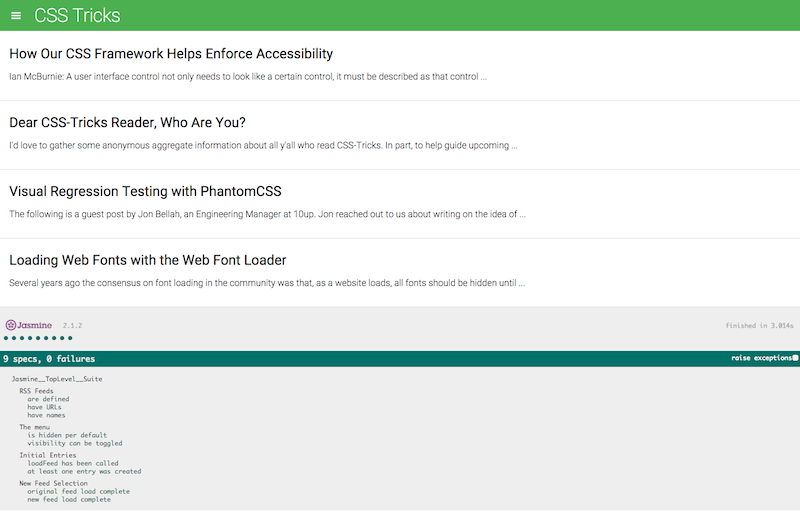

# How to Start

Fork this repository on Github, then clone it onto your machine from your Github account:

```
    $> cd $YOUR_PROJECT_DIR
    $> git clone https://github.com/YOURGITHUBID/frontend-nanodegree-feedreader.git
```
This will create directory $YOUR_PROJECT_DIR/frontend-nanodegree-feedreader containing file index.html. Open index.html in Chrome browser. You will see a page that is partitioned into two halfs. The upper half is the feedreader application and the lower half is the Jasmine test runner showing test results. All test should pass indicating 9 specs, 0 failures.

# Description of tests

1. **Write a test that loops through each feed in the allFeeds object and ensures it has a URL defined and that the URL is not empty:**

   Tested by simply using built in Jasmine expect defined tests on allFeeds array.

2. **Write a test that loops through each feed in the allFeeds object and ensures it has a name defined and that the name is not empty:**

   Tested by simply using built in Jasmine expect defined tests on allFeeds array.

3. **Write a new test suite named "The menu". Write a test that ensures the menu element is hidden by default. You'll have to analyze the HTML and the CSS to determine how we're performing the hiding/showing of the menu element. Write a test that ensures the menu changes visibility when the menu icon is clicked. This test should have two expectations: does the menu display when clicked and does it hide when clicked again:**

   Tested by selecting the menu-hidden class on the body element. Before triggering hide menu it should exist, after triggering hide menu once it should not exist, after triggering hide menu twice it should exist again.

5. **Write a test that ensures when the loadFeed function is called and completes its work, there is at least a single .entry element within the .feed container. Remember, loadFeed() is asynchronous so this test wil require the use of Jasmine's beforeEach and asynchronous done() function:**

   Tested by loading a feed, spying on call completion, and checking for entries.

6. **Write a test that ensures when a new feed is loaded by the loadFeed function that the content actually changes. Remember, loadFeed() is asynchronous:**

   Tested by loading two different feeds and comparing their titles.

7. **When complete all tests pass:**

